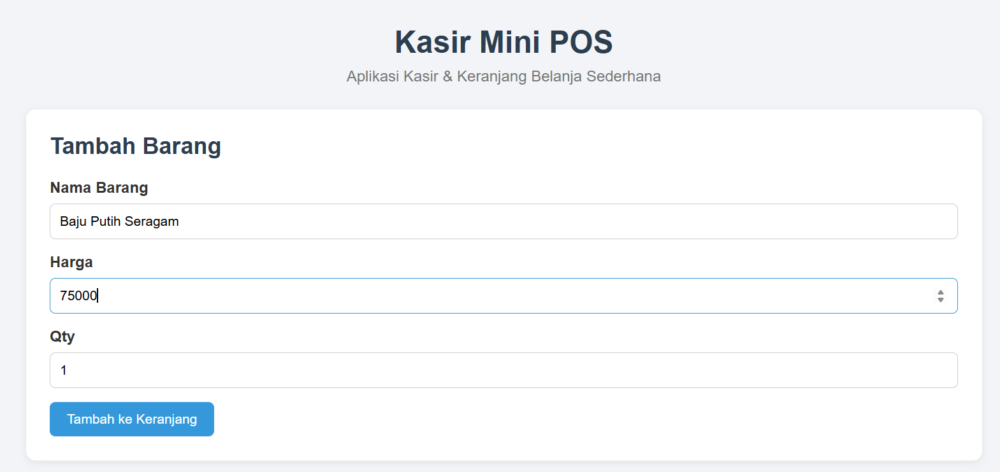
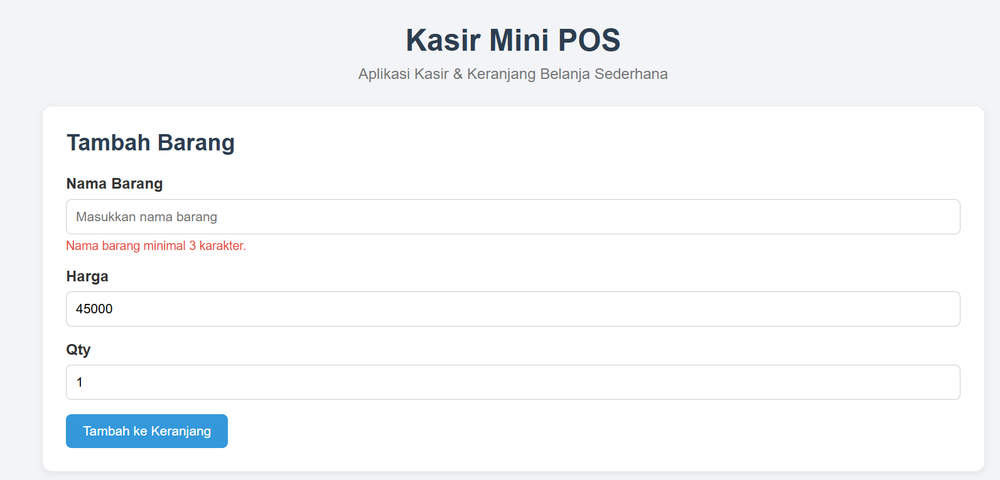
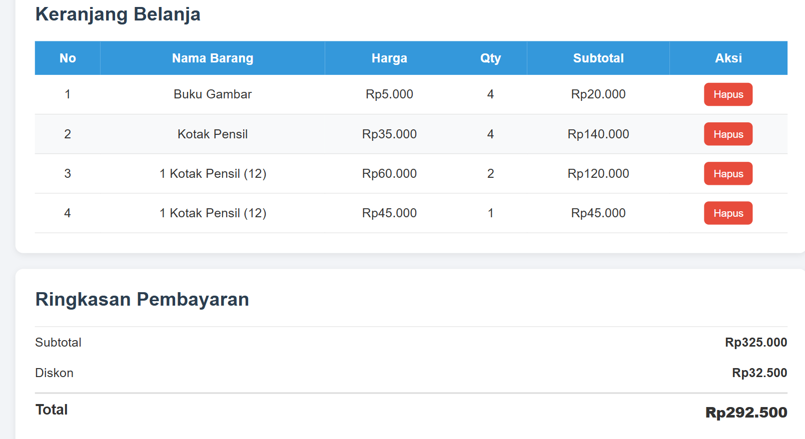
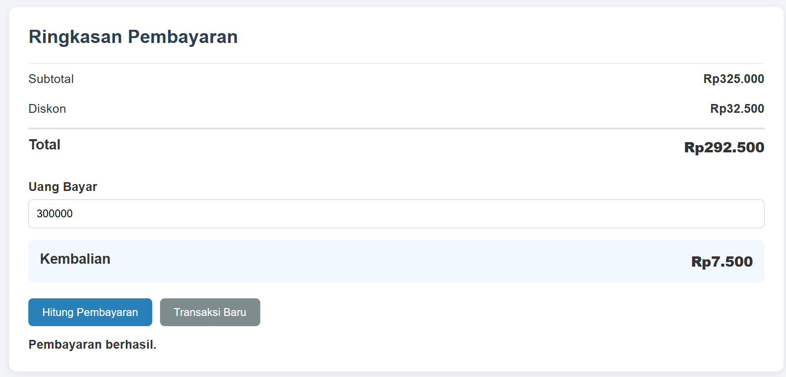

# Kasir Mini POS

## Identitas

Nama: Bethsy Sabrina  
NIM: 124140045  
Mata Kuliah: Praktikum Pemrograman Aplikasi Web  
Pertemuan: 1 - JavaScript Dasar  

## Deskripsi

Kasir Mini POS adalah aplikasi kasir sederhana yang dibuat menggunakan HTML, CSS, dan JavaScript. Aplikasi ini digunakan untuk menambahkan barang ke dalam keranjang, menghitung total belanja, memberikan diskon, menghitung pembayaran, serta menampilkan kembalian.

## Fitur

- Menambahkan barang ke keranjang
- Validasi nama barang, harga, dan jumlah barang
- Menghitung subtotal setiap barang
- Menghitung total belanja
- Diskon 10% untuk total belanja minimal Rp50.000
- Menghitung uang pembayaran dan kembalian
- Menampilkan peringatan jika uang pembayaran kurang
- Menghapus barang dari keranjang
- Menyimpan data keranjang menggunakan LocalStorage
- Menghapus transaksi melalui tombol Transaksi Baru

## Teknologi yang Digunakan

- HTML
- CSS
- JavaScript
- LocalStorage

## Struktur File

TugasJavaScript/
├── index.html
├── style.css
├── script.js
├── README.md

### 1. Tampilan Form Input Utama

### 2. Tampilan Validasi Error

### 3. Hasil Perhitungan dan Riwayat Data

### 4. Tampilan Perhitungan dan Riwayat Data

## Penjelasan Teknis Singkat

### 1. Validasi Input
JavaScript digunakan untuk memeriksa data yang dimasukkan pengguna sebelum data diproses. Jika terdapat input yang kosong atau tidak sesuai, sistem akan menampilkan pesan kesalahan. Dengan adanya validasi ini, data yang masuk menjadi lebih sesuai dan mengurangi kesalahan saat penggunaan aplikasi.

### 2. Kalkulator Keuangan
Kalkulator keuangan digunakan untuk menghitung total pemasukan, total pengeluaran, dan saldo. Sistem mengambil nilai nominal dari data transaksi, kemudian melakukan perhitungan sesuai dengan jenis transaksi. Saldo diperoleh dari total pemasukan dikurangi total pengeluaran.

### 3. Penyimpanan Data dengan localStorage
Data transaksi disimpan menggunakan `localStorage` pada browser. Sebelum disimpan, data diubah menjadi format JSON menggunakan `JSON.stringify()`. Ketika data akan digunakan kembali, JSON diubah menjadi data JavaScript menggunakan `JSON.parse()`. Dengan cara ini, data transaksi tetap tersimpan meskipun halaman browser dimuat ulang.